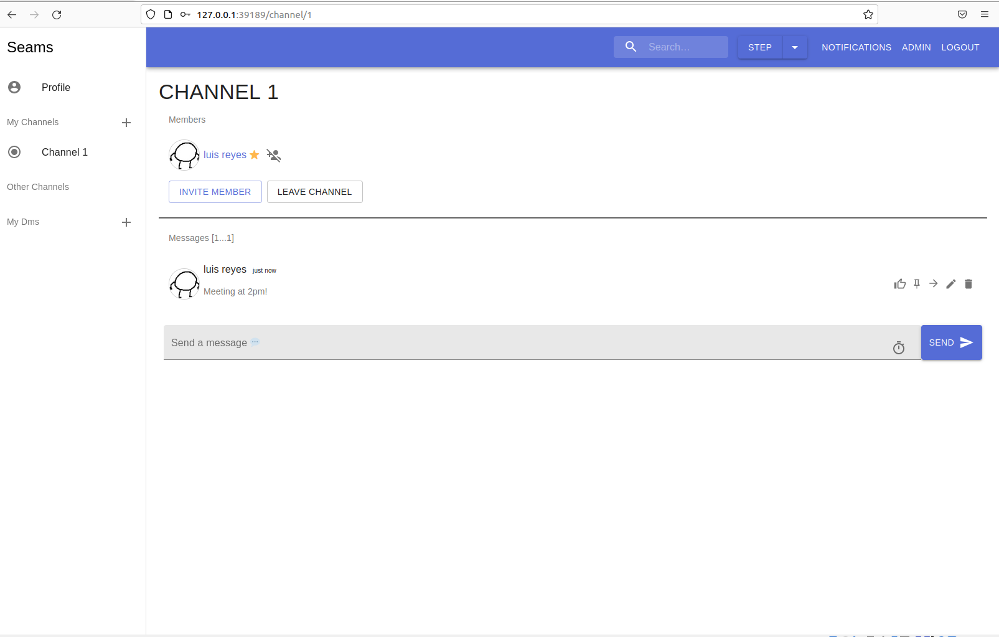

# CSeams
Collaborative Communication Tool built in Python Flask for University Assessment

## Description
Seams is a web service built using Python for its backend similar to MS Teams.  It was built in collaboration with 3 other students as a university project.  It was built using Agile methods and regularly updated on a seperate repository on Gitlab.  This repository is for the purposes of showcasing this work.  The backend was constructed by the group following the RESTful API structure (CRUD).




## Technologies
- Python3
- Flask
- Pickling and Hashing

## Install and Run
- Install Python 3.7.3
- Install module requirements listed in requirements.txt using the command ``` pip3 install -r requirements.txt ```.  If errors with pg_config occur, try running this command ``` sudo apt install libpq-dev ```.
- navigate to path ``` .../backend ``` and start server running command ``` python3 -m src.server ```
- In a seperate terminal window, navigate to path ``` .../frontend ``` and run the command ``` python3 frontend.py 8021 ``` where 8021 is the default port.  This can be changed in ``` .../backend/src/config.py ```
- follow the link printed in the frontend terminal in the browser of your choice.

## Credits
The backend was not solely developed by myself, I would like to attribute Westley Lo, Amy Pham, and Reuel Nkomo as key collaborators in this project.  Furthermore university CSE staff for the given frontend and assessment (university will not be listed to avoid academic misconduct).
